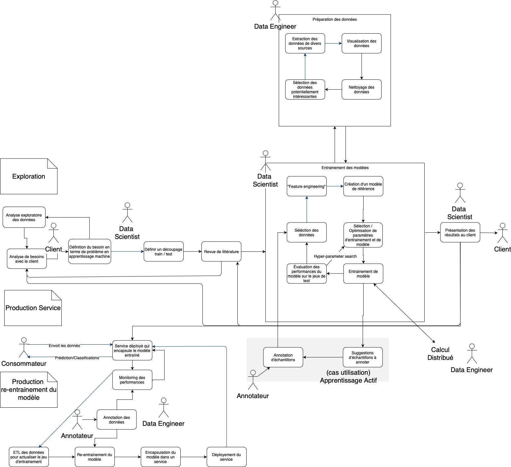
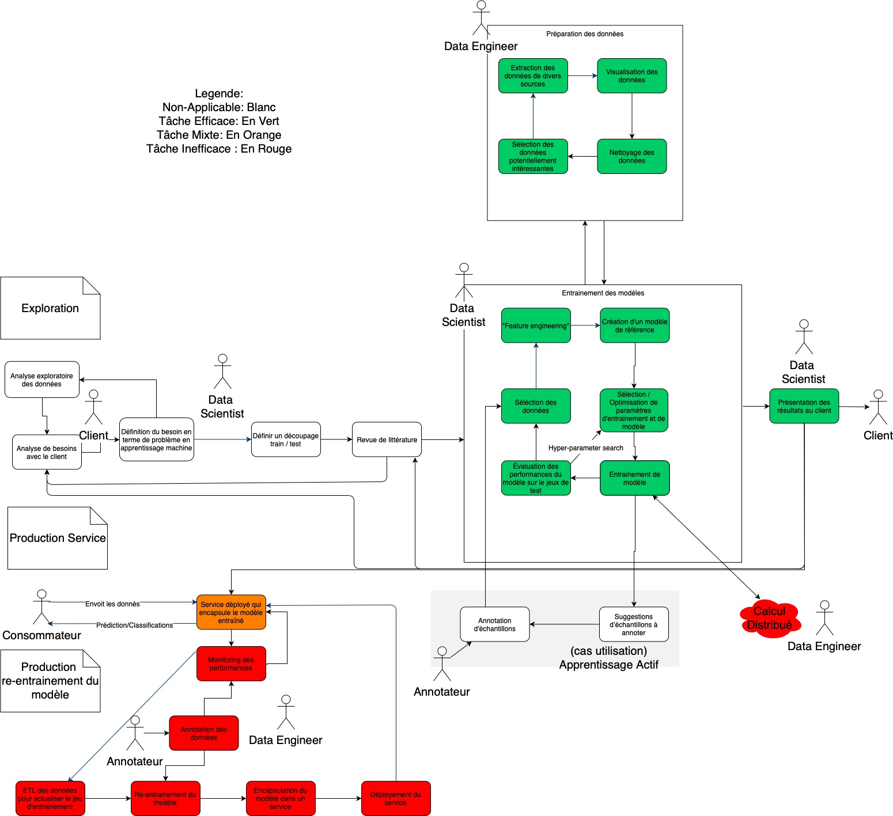

# Plateformes Big Data

Ce document explore les avantages et inconvénients d'utiliser diverses plateformes en science de données. 

## Objectifs
1. Comprendre l'offre est la direction du marché dans le domaine de sciences des données.
1. Évaluer si les plateformes de sciences de données peuvent nous aider à accélérer le développement des modèles.

## Processus de création d'un modèle d'apprentissage machine
(ou _Processus d'analyse en sciences de données_)

Cette section décrit le processus permettant, à partir des données d'entraînement 
fournies par le client, de livrer un algorithme de prédiction / classification. 

[//]: # (Une courte description décrit ensuite comment ce processus est implémenté via les notebooks en python)

Le processus de création d'un modèle d'apprentissage machine commence par la compréhension de la problématique du client, 
et fini avec un algorithme qui permet soit de prédire ou de catégoriser un éventement par rapport aux événements historiques. 

[//]: # (Un simple exemple serait d’entraîner un algorithme à prédire la probabilité qu'un bâtiment passe au feu. L'algorithme est entraîné en utilisant les données historiques des feux de bâtiments.)
Le processus au complet peut être visualisé dans l'image suivante. Nous allons décrire chaque partie en détail ici-bas.

### Nomenclature
Les acteurs dans ce schéma sont:
* **Client**: Personne qui '_commande_' le modèle
* **Consommateur**: personne qui utilise les prédictions / classification du modèle en production.
* **Data Scientist**: Personne responsable de la livraison du modèle au client. 
Ils font les rencontres avec le client, choisissent les données, entraînent le modèle et communiquent le résultat.
* **Data Engineer**: Personne responsable de certains aspects spécifiques du processus d'apprentissage machine
(eg, la mise en production et le _monitoring_ du modèle).
* **Annotateur**: Personne responsable d'annoter les données nécessaires pour entraîner le modèle d'apprentissage machine.

### Section Exploration
La section "Exploration" sert à définir les besoins réalistes est de créer un modèle permettant de faire de répondre à ces besoins.

Voci une description des tâches dans cette section; certaines sont explicites et ne nécessitent pas d'une description 
particulière:

* "Analyse de besoins avec le client"
* "Définition du besoin en termes de problème d'apprentissage machine"
* "Analyse exploratoire des données" (NB: boucle d'itération). 
* "Définir découpage train/test"
* "Revue de littérature" (NB: important de communiquer le résultat de la revue au client)
* La tâche "Préparation des données" sert à créer un set des données de base pouvant servir à entraîner le modèle. 
(NB: Le processus est itératif pour chaque une des sources des données). 
* "entraînement des modèles" 
* "(cas d'utilisation) [Apprentissage Actif](https://en.wikipedia.org/wiki/Active_learning_(machine_learning)". 
Cette technique est utilisée pour itérativement demander des données à chaque cycle d'entraînement (voir ). 
Ceci permet de réduire significativement le nombre d'échantillons nécessitant une annotation manuelle, 
en limitant jusqu'à un certain seuil la qualité du modèle entraîné. 
* "Présentation des résultats" 
    * souvent des visualisations. 
    * le client peut apporter des corrections sur certaines données.
    * le meilleur modèle peut être mis en production si la performance est satisfaisante. 

### Section Production Service
Sert à encapsuler le modèle dans un service en production et de le rendre disponible aux clients.

Voci une description des tâches dans cette section; certaines sont explicites et ne nécessitent pas d'une description 
particulière:

* "Service déployé qui encapsule le modèle entraîne" sert à encapsuler le meilleur modèle entraîné précédemment
 dans un service. 
    * Le client pourrait appeler le service via un API pour obtenir des prédictions / classification etc . 

### Section Production re-entraînement du modèle
Sert à créer un pipeline permettant de re-entraîner le modèle automatiquement et de le redéployer en production.

* La tâche "Monitoring de performances" surveille les performances du modèle sur les données de production 
via des KPI / indicateurs spécifiques. 
    * peut lancer le ré-entraînement. 
* "Annotation des données". 
* "ETL des données pour actualiser le jeu d'entraînement" cherche les données des diverses sources.
* "Re-entraînement du modèle".
* "Encapsulation du modèle dans un service". 
* "Déploiement du service".

## Exploration des plateformes

* Plateformes étudiées : KNIME, H2O.ai, Domino, Databricks.
* Plateforme de base: Jupyter Notebooks.

#### Critères d'analyse

Chaque cadriciel serait analysé selon les critères suivants:
1. **Besoin minimal d'infrastructure**: minimum d'infrastructure dont un client besoin pour commencer à utiliser 
la solution. 
1. **Impact sur le "_Processus de création du modèle d'apprentissage machine_"**: 
efficacité à réaliser diverses tâches du processus d'apprentissage machine.
1. **Courbe d'apprentissage pour chaque intervenant (DataScientist, DataEngineer)**
1. **Mise à l'échelle pour des volumes larges de données**: 
effort nécessaire (logiciels, infrastructure) afin de pouvoir travailler avec des set de données larges (1G+ ,10M+ de rangées).  
1. **Scalabilité organisationnelle et DevOps**: facilité de créer et déployer une large quantité de modèles 
par un large éventail de personnes. 

### Jupyter Notebooks

* Besoin minimal d'infrastructure : 
    * L'installation minimale requiert une machine virtuelle/ physique ayant Windows, Linux ou macosx. 
    * L'installation requiert python avec au minimum les libraires pandas, scikit-learn , matplotlib et jupytelab. 
    * Le tout est open source.
* Impact sur le "Processus de création du modèle d'apprentissage machine" 
(voir Image; vert == efficace; rouge == inefficace)
    * Points positifs:
        * **Les Notebook python sont interactifs, rendant les itérations d'essais très rapides**.
        Excellent pour "Préparation des données" et "entraînement des modèles".
        * **Il y a énormément de librairies dans python permettant d'extraire, manipuler et visualiser 
        les données**. Excellent pour "Préparation des données".
        * **Il y a énormément de libraires d'apprentissage machine** (par exemple scikit-learn) permettant 
        d’entraîner divers modelés de façon standardisée, et de changer des modèles rapidement et facilement. 
        * **Il y a plusieurs librairies pour faire paralléliser le calcul** (par exemple Dask) et du calcul distribué. 
        Bon pour "entraînement des modèles".
        * L'interactivité et la quantité des **libraires de visualisation** disponibles permettent de présenter 
        efficacement et rapidement des résultats au client.
    * Points négatifs:
        * **Il n'y a pas un système facile et automatique pour faire une mise en production**. 
        Une fois le prototype et la présentation terminés, il est nécessaire de réécrire manuellement 
        les Notebooks en applications. 
        * **Tout le processus de rebuild et redéploiement être fait avec d'autres outils** 
        (Airflow (https://airflow.apache.org/) , Jenkins (https://jenkins.io/) etc ...).
        * **La tâche calcul distribué doit être montée "from scratch"** par les Data Engineers.
* Courbe d'apprentissage pour chaque intervenant (DataScientist, DataEngineer): 
    * Élevée pour les DataScientists puisqu'il faut apprendre python + librairies data science + librairies de visualisation.
    * Élevée pour les DataEngineer  puisqu'il faut apprendre python + librairies de visualisation et diverses librairies de calcul distribué (Dask est un exemple). À noter par contre que dans le cas de Datasets de petite taille (<1G), un DataEngineer n'est pas nécessaire.
* Mise à l'échelle pour des volumes larges de données: 
    **Difficile à faire marcher avec du "Big Data" pour des données texte / numériques**, 
    car les données d'entraînement doivent entrer en mémoire. 
    Il est possible de le faire avec Dask ou d'autres libraires de parallélisation de calcul, 
    mais ce n'est pas trivial, et il faut adapter les algorithmes manuellement.
* Scalabilité organisationnelle et DevOps: **difficile** car: 
    * pas de processus uniformisé de mise en production.
    * pas de mécanisme standard d'avoir la sécurité d’accès au modèles entraînes qui sont déployées en production. Même problématique pour sécuriser les accès aux diverses ressources (Ex.: base de données, HDFS etc.) nécessaires pour le réentraînement.
    * Gestion de permissions limitée pour les notebooks (mot de passe ou token)
    * Due à leurs grande flexibilité, les Notebooks n'offrent pas de standards de code par défault.
    * Beaucoup de Devops requis
    * pas de gestion ni de datasets d'entraînement, ni de résultats
    * Difficile de prévoir la demande et les coûts pour la demande computationnelle.

Produits similaires: Notebooks R
