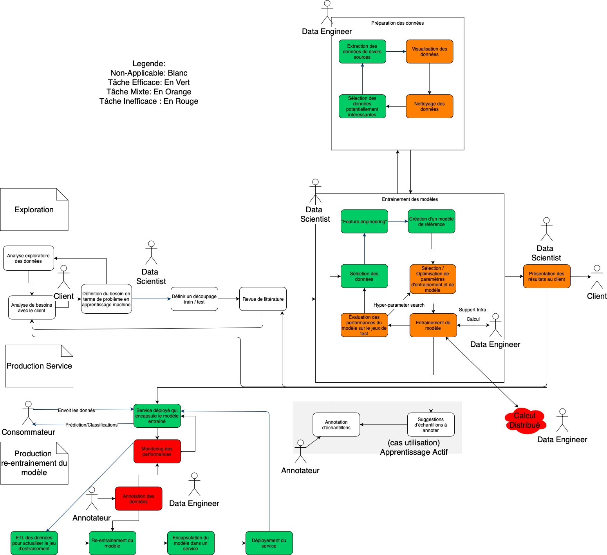

# Plateformes Big Data

Ce document explore les avantages et inconvénients d'utiliser diverses plateformes en science de données. 

## Objectifs
1. Comprendre l'offre est la direction du marché dans le domaine de sciences des données.
1. Évaluer si les plateformes de sciences de données peuvent nous aider à accélérer le développement des modèles.

## Processus de création d'un modèle d'apprentissage machine
(ou _Processus d'analyse en sciences de données_)

Cette section décrit le processus permettant, à partir des données d'entraînement 
fournies par le client, de livrer un algorithme de prédiction / classification. 

[//]: # (Une courte description décrit ensuite comment ce processus est implémenté via les notebooks en python)

Le processus de création d'un modèle d'apprentissage machine commence par la compréhension de la problématique du client, 
et fini avec un algorithme qui permet soit de prédire ou de catégoriser un éventement par rapport aux événements historiques. 

[//]: # (Un simple exemple serait d’entraîner un algorithme à prédire la probabilité qu'un bâtiment passe au feu. L'algorithme est entraîné en utilisant les données historiques des feux de bâtiments.)
Le processus au complet peut être visualisé dans l'image suivante. Nous allons décrire chaque partie en détail ici-bas.

### Nomenclature
Les acteurs dans ce schéma sont:
* **Client**: Personne qui '_commande_' le modèle
* **Consommateur**: personne qui utilise les prédictions / classification du modèle en production.
* **Data Scientist**: Personne responsable de la livraison du modèle au client. 
Ils font les rencontres avec le client, choisissent les données, entraînent le modèle et communiquent le résultat.
* **Data Engineer**: Personne responsable de certains aspects spécifiques du processus d'apprentissage machine
(eg, la mise en production et le _monitoring_ du modèle).
* **Annotateur**: Personne responsable d'annoter les données nécessaires pour entraîner le modèle d'apprentissage machine.

### Section Exploration
La section "Exploration" sert à définir les besoins réalistes est de créer un modèle permettant de faire de répondre à ces besoins.

Voci une description des tâches dans cette section; certaines sont explicites et ne nécessitent pas d'une description 
particulière:

* "Analyse de besoins avec le client"
* "Définition du besoin en termes de problème d'apprentissage machine"
* "Analyse exploratoire des données" (NB: boucle d'itération). 
* "Définir découpage train/test"
* "Revue de littérature" (NB: important de communiquer le résultat de la revue au client)
* La tâche "Préparation des données" sert à créer un set des données de base pouvant servir à entraîner le modèle. 
(NB: Le processus est itératif pour chaque une des sources des données). 
* "entraînement des modèles" 
* "(cas d'utilisation) [Apprentissage Actif](https://en.wikipedia.org/wiki/Active_learning_(machine_learning)". 
Cette technique est utilisée pour itérativement demander des données à chaque cycle d'entraînement (voir ). 
Ceci permet de réduire significativement le nombre d'échantillons nécessitant une annotation manuelle, 
en limitant jusqu'à un certain seuil la qualité du modèle entraîné. 
* "Présentation des résultats" 
    * souvent des visualisations. 
    * le client peut apporter des corrections sur certaines données.
    * le meilleur modèle peut être mis en production si la performance est satisfaisante. 

### Section Production Service
Sert à encapsuler le modèle dans un service en production et de le rendre disponible aux clients.

Voci une description des tâches dans cette section; certaines sont explicites et ne nécessitent pas d'une description 
particulière:

* "Service déployé qui encapsule le modèle entraîne" sert à encapsuler le meilleur modèle entraîné précédemment
 dans un service. 
    * Le client pourrait appeler le service via un API pour obtenir des prédictions / classification etc . 

### Section Production re-entraînement du modèle
Sert à créer un pipeline permettant de re-entraîner le modèle automatiquement et de le redéployer en production.

* La tâche "Monitoring de performances" surveille les performances du modèle sur les données de production 
via des KPI / indicateurs spécifiques. 
    * peut lancer le ré-entraînement. 
* "Annotation des données". 
* "ETL des données pour actualiser le jeu d'entraînement" cherche les données des diverses sources.
* "Re-entraînement du modèle".
* "Encapsulation du modèle dans un service". 
* "Déploiement du service".

## Exploration des plateformes

* Plateformes étudiées : KNIME, H2O.ai, Domino, Databricks.
* Plateforme de base: Jupyter Notebooks.

#### Critères d'analyse

Chaque cadriciel serait analysé selon les critères suivants:
1. **Besoin minimal d'infrastructure**: minimum d'infrastructure dont un client besoin pour commencer à utiliser 
la solution. 
1. **Impact sur le "_Processus de création du modèle d'apprentissage machine_"**: 
efficacité à réaliser diverses tâches du processus d'apprentissage machine.
1. **Courbe d'apprentissage pour chaque intervenant (DataScientist, DataEngineer)**
1. **Mise à l'échelle pour des volumes larges de données**: 
effort nécessaire (logiciels, infrastructure) afin de pouvoir travailler avec des set de données larges (1G+ ,10M+ de rangées).  
1. **Scalabilité organisationnelle et DevOps**: facilité de créer et déployer une large quantité de modèles 
par un large éventail de personnes. 

### Point de départ: Jupyter Notebooks

* Besoin minimal d'infrastructure : 
    * L'installation minimale requiert une machine virtuelle/ physique ayant Windows, Linux ou macosx. 
    * L'installation requiert python avec au minimum les libraires pandas, scikit-learn , matplotlib et jupytelab. 
    * Le tout est open source.
* Impact sur le "Processus de création du modèle d'apprentissage machine" 
(voir Image; vert == efficace; rouge == inefficace)
    * Points positifs:
        * **Les Notebook python sont interactifs, rendant les itérations d'essais très rapides**.
        Excellent pour "Préparation des données" et "entraînement des modèles".
        * **Il y a énormément de librairies dans python permettant d'extraire, manipuler et visualiser 
        les données**. Excellent pour "Préparation des données".
        * **Il y a énormément de libraires d'apprentissage machine** (par exemple scikit-learn) permettant 
        d’entraîner divers modelés de façon standardisée, et de changer des modèles rapidement et facilement. 
        * **Il y a plusieurs librairies pour faire paralléliser le calcul** (par exemple Dask) et du calcul distribué. 
        Bon pour "entraînement des modèles".
        * L'interactivité et la quantité des **libraires de visualisation** disponibles permettent de présenter 
        efficacement et rapidement des résultats au client.
    * Points négatifs:
        * **Il n'y a pas un système facile et automatique pour faire une mise en production**. 
        Une fois le prototype et la présentation terminés, il est nécessaire de réécrire manuellement 
        les Notebooks en applications. 
        * **Tout le processus de rebuild et redéploiement être fait avec d'autres outils** 
        (Airflow (https://airflow.apache.org/) , Jenkins (https://jenkins.io/) etc ...).
        * **La tâche calcul distribué doit être montée "from scratch"** par les Data Engineers.
* Courbe d'apprentissage pour chaque intervenant (DataScientist, DataEngineer): 
    * Élevée pour les DataScientists puisqu'il faut apprendre python + librairies data science + librairies de visualisation.
    * Élevée pour les DataEngineer  puisqu'il faut apprendre python + librairies de visualisation et diverses librairies de calcul distribué (Dask est un exemple). À noter par contre que dans le cas de Datasets de petite taille (<1G), un DataEngineer n'est pas nécessaire.
* Mise à l'échelle pour des volumes larges de données: 
    **Difficile à faire marcher avec du "Big Data" pour des données texte / numériques**, 
    car les données d'entraînement doivent entrer en mémoire. 
    Il est possible de le faire avec Dask ou d'autres libraires de parallélisation de calcul, 
    mais ce n'est pas trivial, et il faut adapter les algorithmes manuellement.
* Scalabilité organisationnelle et DevOps: **difficile** car: 
    * pas de processus uniformisé de mise en production.
    * pas de mécanisme standard d'avoir la sécurité d’accès au modèles entraînes qui sont déployées en production. Même problématique pour sécuriser les accès aux diverses ressources (Ex.: base de données, HDFS etc.) nécessaires pour le réentraînement.
    * Gestion de permissions limitée pour les notebooks (mot de passe ou token)
    * Due à leurs grande flexibilité, les Notebooks n'offrent pas de standards de code par défault.
    * Beaucoup de Devops requis
    * pas de gestion ni de datasets d'entraînement, ni de résultats
    * Difficile de prévoir la demande et les coûts pour la demande computationnelle.

Produits similaires: Notebooks R

### KNIME

Chaque cas de travail dans KNIME est composé de plusieurs nœuds liés dans un espace de travail qui est une grosse grille. Un nœud prend des données en entrée, fait des transformations et retourne une sortie. Les sorties d'un nœud sont utilisées comme des entrées des nœuds suivants, ce qui transforme tout le processus en un flux. Des commentaires peuvent être ajoutés afin de rendre le diagramme plus compréhensible. Voici un exemple:

* Besoin minimal d'infrastructure :
    * L'installation minimale requiert une machine virtuelle/ physique ayant Windows, Linux ou macosx. 
    * L'installation installe un serveur de travail.
* Impact sur le "Processus de création du modèle d'apprentissage machine" : 
    * Points positifs:
        * Les tâches "Préparation des données" et "entraînement des modèles" peuvent être effectuées très rapidement 
        et facilement dans le cas que des noeuds existent pour faire le prétraitement/ entraînement du modelé. 
            * Dans le cas échéant écrire du code "custom" est plus compliqué qu’avec les Notebooks python.
        * Les visualisations des données de base sont assez bonnes. 
            * Par contre, ils ne sont pas très beaux / interactifs. Avoir des visualisations sur mesure est compliqué.
        * Le pipeline de traitement simplifie la visibilité pour un traitement simple, mais peut être très dur à suivre 
            pour un traitement complexe, sans compter une exécution très lente.
        * Il y a beaucoup de nœuds permettant de paramétrer divers algorithmes d’apprentissage machine. 
            * Il est par contre compliqué d'optimiser / paralléliser les diverses taches.
        * Il est possible de faire des rapports, 
            * mais il n'est pas possible d'avoir des rapports interactifs de la même qualité qu’avec le Jupyter Notebook.
        * Le pipeline de traitement est facilement portable de l'environnement de développement en production.
        * Il est possible de créer facilement une application REST avec un modèle entraîné. 
        L'application REST roule sur le serveur de KNIME, prend un JSON en entrée et renvoie un JSON en sortie.
    * Points négatifs:
        * La tâche calcul distribué doit être montée "from scratch" par les Data Engineers.
         Il y a du support pour exécuter des tâches sur Spark, mais il faut monter le cluster Spark soi-même.
* Courbe d'apprentissage pour chaque intervenant (DataScientist, DataEngineer): 
    * Très basse les DataScientists pour des modèles / pipelines de traitement simples. 
    La courbe d’apprentissage augmente significativement dans les cas d'optimisation de performance / création des noeuds "custom".
    * Élevée pour les DataEngineer pour paralléliser le calcul.
* Mise à l'échelle pour des volumes larges de données: 
    Très difficile d’entraîner des modèles sur du "Big Data" (plus difficile qu’avec Jupyter Notebooks). 
    Il est possible de connecter KNIME sur un cluster Spark, mais c'est une autre paire de manches.
* Scalabilité organisationnelle et DevOps: 
    Considérant la possibilité de convertir un modèle en serveur REST via le serveur KNIME directement, 
    ainsi que la façon standard de créer un pipeline, KNIME peut être un assez bon compromis dans le cas que les modèles 
    entraînés soient assez simples.
* Devops: Il n'y a pas de gestion, ni de datasets d'entraînement, ni de résultats.
Toute la gestion de ressources computationnelles est faite à bras. Difficile de prévoir la demande et les coûts.

Produits similaires: Rapid Miner

### Databricks

Databricks offre une solution intégrée pour faire des analytiques sur des données massives. 
Le mot clé est intégration des technologies permettant de faire de l'apprentissage machine dans Spark. 
Dans le cadre de cette étude, nous allons nous focaliser principalement sur les notebooks Databricks, 
qui permettent de faire de l'exploration ainsi que d’entraîner des modèles de science de données. 

* Besoin minimal d'infrastructure :
    * Un compte nuage (AWS / Azure) avec un noeud pour exécuter un notebook Databricks.
* Impact sur le "Processus de création du modèle d'apprentissage machine" : 
    * Points positifs:
        * Les notebooks python sont interactif, rendant les itérations d'essais très rapides. 
        Ceci accélère les tâches "Préparation des données" et "entraînement des modèles".
        * Il y a énormément de librairies dans python permettant d'extraire, manipuler et visualiser les données 
        ce qui accéléré la tâche "Préparation des données". 
        De plus, Spark permet de paralléliser automatiquement un plusieurs tâches de traitement dépendamment 
        de la capacité du cluster. 
        * De plus il est possible de manipuler les données via un api SQL (Spark SQL). 
        Par contre les messages d'erreurs de Spark sont beaucoup moins explicites que ceux faits par python via un notebook python.
    * Le nombre de libraires d'apprentissage machine natives à Spark est plus limité (spark ml). 
    Par contre, il est possible d'utiliser certaines librairies d'apprentissage machine comme scikit-learn directement 
    dans python, puis utiliser Spark comme un outil de distribution de tâches 
    (voir: https://databricks.com/blog/2016/02/08/auto-scaling-scikit-learn-with-apache-spark.html ). 
    Pour intégrer d'autres librairies voir: https://docs.databricks.com/spark/latest/mllib/index.html#third-party-libraries. 
        * L'intégration des algorithmes "third-party" n'est pas facile.
    * L'interactivité et la quantité des libraires de visualisation disponibles permettent de présenter efficacement 
    et rapidement des résultats au client.
    * Databricks offre plusieurs API's permettant de faire de l'intégration continue et par conséquent d'automatiser 
    l'entraînement et le déploiement de modèles 
    (voir: https://databricks.com/blog/2017/10/30/continuous-integration-continuous-delivery-databricks.html ). 
    Il est aussi possible d’exporter les modelés entraînes via MLeap 
    (https://docs.databricks.com/spark/latest/mllib/mleap-model-export.html#) 
    ou de les déployer dans un API web utilisant MLflow et AWS SageMaker 
    (https://docs.databricks.com/spark/latest/mllib/mlflow-deployment.html).
    * Le calcul distribué est fait sur Spark. Les clusters de calculs Spark peuvent être créés sur demande via 
    un petit formulaire UI. 
        * Dans le cas que l'algorithme exécuté requière un autre type de cluster, il faut monter ce dernier à bras.
* Courbe d'apprentissage pour chaque intervenant (DataScientist, DataEngineer):
    * Élevée pour les DataScientists puisqu'il faut apprendre python + librairies data science + librairies de visualisation + PySpark.
    * Élevée pour les DataEngineer puisqu'il faut apprendre python + librairies de visualisation + PySpark. 
* Mise à l'échelle pour des volumes larges de données: 
    * Le prétraitement des données scale très bien avec Spark. 
        * Il suffit d'augmenter la taille du cluster pour avoir une augmentation de performance proportionnelle. 
        * La scalabilité d'entraînement des modèles dépend de l'implémentation des modèles. 
        Databricks permet une intégration avec H2O.ai pour paralléliser l'exécution des algorithmes.
* Scalabilité organisationnelle et DevOps: 
    Databricks offre plusieurs mécanismes rendant la scalabilité organisationnelle efficace :
    * Il y a plusieurs processus de mise en production vi MLFlow 
    (https://docs.databricks.com/spark/latest/mllib/mlflow-deployment.html) .
    * Il y a pas de mécanisme standard d'avoir la sécurité d’accès au modèle entraînes qui sont déployées en production. 
    * Peu de Devops:
        * Les données sont sauvegardées dans le nuage, ce qui fait que le stockage auto-scale.
        * Les clusters de calculs Spark peuvent être créés sur demande via un petit formulaire UI. Un mécanisme existe pour restreindre la quantité de ressources utilisables par usager.
        * Par contre, due à leurs grande flexibilité, les notebooks n'offrent de standards de code par défaut.
* Points importants:
    * Très cher en plus d'avoir besoin d'un compte nuage
    * Pas de support de Bitbucket server (https://docs.databricks.com/user-guide/notebooks/bitbucket-cloud-version-control.html).
    * Spark tax (exécution de chaque cellule prends au moins 2-3 secondes).
